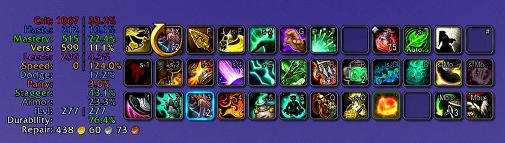
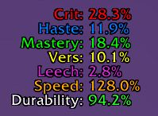
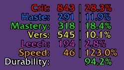
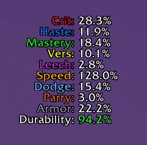
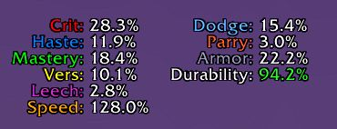
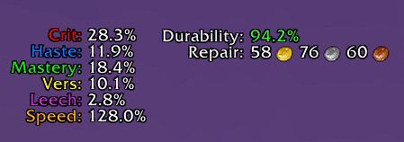
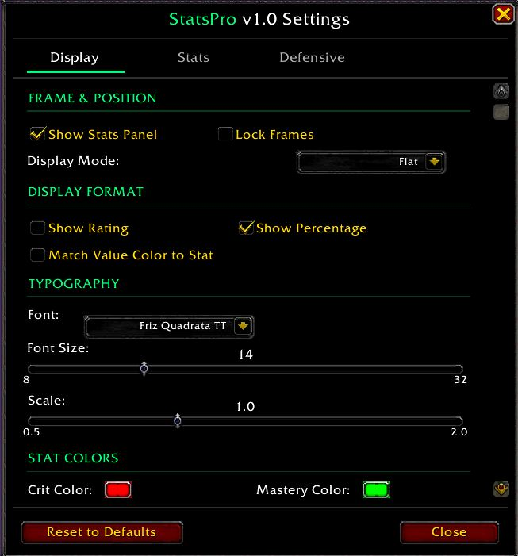

# StatsPro

A lightweight on-screen HUD for World of Warcraft Retail. Displays secondary stats,
defensive stats, durability and live repair cost in a clean, draggable panel — no
heavy framework needed.

  

> Originally inspired by [SwiftStats by TaylorSay](https://www.curseforge.com/wow/addons/swiftstats)
> (MIT). StatsPro is substantially rewritten — only ~9% of upstream code remains
> verbatim (defaults and boilerplate). The defensive panel, durability/repair-cost
> system, multi-panel layouts, auto-aligning column rendering, 12.x retail secret-value
> handling, and the three-tab settings UI are all original work. See
> [`CHANGELOG.md`](CHANGELOG.md) for the full list of additions per version.

## Features

- **Secondary stats** — Crit, Haste, Mastery, Versatility (with rating + percentage display options)
- **Tertiary stats** — Leech, Avoidance, Speed
- **Primary stats** — Strength, Agility, Intellect (per-stat toggle)
- **Defensive panel** — Dodge, Parry, Block, Armor (as % damage reduction)
- **Durability** — average or worst-slot percentage with auto-color thresholds (green / yellow / red)
- **Repair cost** — live vendor-format coin display (`46g 40s 81c` with embedded gold/silver/copper icons)
- **Three display modes** — Flat (one panel), Sectioned (one panel with header divider), Split (separate movable panels for offensive vs defensive)
- **Localized stat labels** — on-screen panel auto-translates to your WoW client language across all 11 retail locales (deDE, esES, esMX, frFR, itIT, koKR, ptBR, ruRU, zhCN, zhTW; English unchanged). One-click toggle on the Display tab if you prefer compact English.
- **Customization** — per-stat colors, fonts via LibSharedMedia, font size, panel scale, refresh rate
- **Auto-aligning columns** — labels and values stay neatly aligned regardless of which stats are enabled, font, or scale; toggling rating-only or percent-only collapses cleanly into one tight column with no awkward gaps
- **Light footprint** — single-file pure Lua (~2.3k lines), no Ace3, no embedded UI library

## How it looks

**Flat mode (default) — secondary stats in one tight panel:**

**Rating and percentage side by side — enable both display modes to see the underlying combat ratings alongside the resulting percentages, with three perfectly aligned columns:**

**Defensive panel enabled — Dodge, Parry, Armor as % damage reduction:**

**Split mode — offensive and defensive on separate movable panels:**

**Live repair cost at the vendor — vendor-format coin string with inline gold/silver/copper icons:**

## Localization

Stat labels render in your WoW client's language by default — no setup required.
Curated short-form translations across all 11 retail WoW locales preserve the same
compact 4-7 char visual rhythm as the original English labels:

| Locale | Sample row |
|---|---|
| **enUS** | `Crit:    843  28.3%` |
| **ruRU** | `Крит:    843  28.3%` |
| **deDE** | `Krit:    843  28.3%` |
| **frFR** | `Crit:    843  28.3%` |
| **esES** / **esMX** | `Crít:    843  28.3%` |
| **itIT** | `Crit:    843  28.3%` |
| **ptBR** | `Crít:    843  28.3%` |
| **koKR** | `치명:    843  28.3%` |
| **zhCN** | `暴击:    843  28.3%` |
| **zhTW** | `致命:    843  28.3%` |

To revert to compact English on a non-English client: open `/ss` → **Display** tab →
**Localization** → uncheck *Use localized stat names*. Setting persists across
`/reload` and across all characters on the account. The toggle is hidden on enUS
clients (no localized form to switch to).

If a label reads oddly to you as a native speaker, please open an issue with the
suggested correction — single-row fixes ship in the next patch.

## Slash commands

| Command | Action |
|---|---|
| `/ss` or `/statspro` | Open settings window |
| `/ss show` | Show stats panel |
| `/ss hide` | Hide stats panel |
| `/ss toggle` | Toggle visibility |
| `/ss debug` | Dump runtime state to chat (for bug reports) |
| `/ss help` | List commands in chat |

## Installation

**CurseForge:** [www.curseforge.com/wow/addons/statspro](https://www.curseforge.com/wow/addons/statspro)
— install via the CurseForge App or WowUp.

**Manual:** download the latest zip from the
[Releases page](https://github.com/Antrakt92/StatsPro/releases/latest), extract the
`StatsPro` folder into `World of Warcraft\_retail_\Interface\AddOns\`.

## Configuration

Type `/ss` or click the StatsPro entry in the Blizzard AddOns settings panel to open
the configuration window.

| Tab | What lives here |
|---|---|
| **Display** | Master visibility, lock, display mode, localization toggle (non-English clients), font, font size, panel scale, refresh rate, color presets |
| **Stats** | Per-stat toggles for Primary (Str/Agi/Int), Offensive (Crit/Haste/Mastery/Vers) and Tertiary (Leech/Avoidance/Speed) with inline color swatches |
| **Defensive** | Per-stat toggles for Dodge/Parry/Block/Armor, durability options (auto-color, worst-slot vs average), repair cost |

## Compatibility

- **WoW Retail** — Interface `120005, 120007` (The War Within / Midnight)
- Classic / TBC / MoP Classic — not supported (Retail-only at this time)

## Architecture (contributors / forks)

Single-file design. Everything renders out of [`StatsPro.lua`](StatsPro.lua):

- **`Panel:SetTextSafe`** — three-FontString rendering (label / rating / value), each
  with its own `JustifyH` for column alignment, plus two more for the dedicated
  repair row (label + coin). Caches non-secret widths per render to survive in-combat
  measurement taint.
- **`FmtRatingPct` / `FmtPctOnly` / `RouteValueOnly`** — column-routing helpers.
  Dual-column mode = both display toggles on; otherwise everything stacks in the
  rating column. `IsDualColMode()` is the single source of truth for that decision.
- **`UpdateStats`** — drives the per-frame OnUpdate, dispatches by display mode
  (flat / sectioned / split), gates value-column joining on `IsDualColMode()`.
- **`LABELS_BY_LOCALE` + `L()` + `FormatLabel()`** — i18n layer. One table indexed
  by `GetLocale()` return values; helpers compose color + localized label in a
  single call. Identity-fast-path when toggle is off (no allocation, no table read).
- **`MigrateDB`** — DB schema versioning. Bump `CURRENT_DB_VERSION` and add a
  conditional `vN-1 → vN` clause when changing a default value, so existing users
  on the old default upgrade automatically while explicit user choices are preserved.

The repository's [`CHANGELOG.md`](CHANGELOG.md) documents what shipped per version and
why. Tricky 12.x retail API behavior (secret-value handling, FontString taint, layout
ordering quirks) is annotated as `WHY:` / `WARNING:` comments at the relevant call sites.

## Bug reports / feature requests

Open an issue on [GitHub Issues](https://github.com/Antrakt92/StatsPro/issues). Helpful
to include: WoW client version, addon version (visible in the settings window header),
exact reproduction steps, and a screenshot if the issue is visual.

## Acknowledgements

- **[TaylorSay](https://www.curseforge.com/members/taylorsay)** — author of the original
  [SwiftStats](https://www.curseforge.com/wow/addons/swiftstats) addon (MIT), the
  project that inspired StatsPro and from which the initial defaults and color scheme
  are derived.
- **[LibSharedMedia-3.0](https://www.curseforge.com/wow/addons/libsharedmedia-3-0)** — font selection support.

## License

[MIT](LICENSE) — copyright held by Antrakt for original code (~91% of the codebase)
and by TaylorSay for derived portions (~9%, mostly defaults and boilerplate from
upstream SwiftStats).
