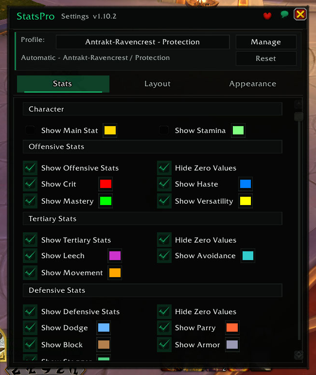
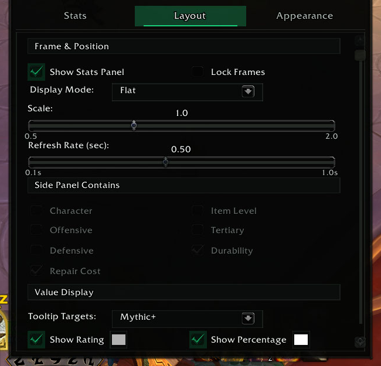
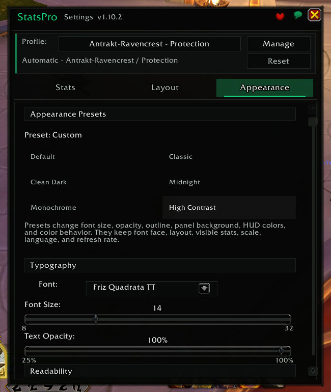
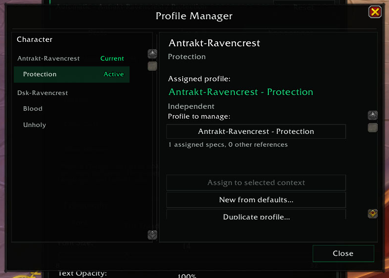

  

<h1 align="center">StatsPro</h1>

  
  
  
  

  A standalone stats and gear HUD for World of Warcraft Retail: Midnight (12.x).
  Keep the numbers you use visible in clean, draggable panels, with per-character
  and per-specialization profiles plus bundled Archon M+ and Raid reference snapshots.

  

## Why players use StatsPro

- **See the useful numbers without opening the Character panel.** Show secondary
  stats, item level, defensives, durability, and repair cost directly on the HUD.
- **Compare ratings with current context.** Hover Crit, Haste, Mastery, or
  Versatility for bundled Archon M+ High Keys or Raid Mythic reference snapshots.
- **Switch characters or specs without rebuilding the HUD.** Assigned profiles
  activate automatically and can be shared intentionally when that is useful.
- **Start with a finished look.** Preview six appearance presets, then keep the
  preset or adjust individual fonts, colors, opacity, outline, and background.
- **Use only the space you want.** Build a compact secondary-stat strip, a tank
  dashboard, or two independently movable panels.
- **Designed for Retail 12.x.** StatsPro handles Midnight's restricted values and
  modern tooltip data without a companion app or in-game network access.

## Flexible layouts

Choose **Flat**, **Sectioned**, or **Split**. Panels resize around enabled rows,
rating and percentage columns stay aligned, and Split mode lets you move selected
blocks to a separate panel.

  
  

## Profiles and appearance

Every visited character and specialization can use its own profile, or share one
with another context. The Profile Manager can create, duplicate, rename, assign,
swap, reset, and delete profiles, as well as copy only **Stats**, **Layout**, or
**Appearance** settings. Tank, Healer, and Damage role templates can seed future
specializations, and bulk actions help organize already visited characters.

Six appearance presets are included:

- **Default**
- **Classic**
- **Clean Dark**
- **Midnight**
- **Monochrome**
- **High Contrast**

Preset preview changes presentation only. It does not change visible stats, panel
routing, positions, scale, language, refresh rate, or profile assignments. When
panels are unlocked, Settings shows temporary outlines and drag handles so their
positions are clear; this editing chrome never becomes part of the saved HUD.

  
  

## Stats and gear rows

| Area | Available rows |
|---|---|
| **Offensive** | Crit, Haste, Mastery, Versatility |
| **Character** | Main stat (automatic), Stamina |
| **Tertiary** | Leech, Avoidance, Movement |
| **Defensive** | Dodge, Parry, Block, Brewmaster Stagger, Armor damage reduction |
| **Gear** | Equipped / overall item level, durability, worst-slot durability, repair cost |

Every row is optional. Rated stats can show rating, percentage, or both. Repair
cost uses the same gold / silver / copper presentation as the vendor UI.

## Archon reference snapshots

Choose one of two bundled datasets:

- **Mythic+** — High Keys / All Dungeons / This Week
- **Raid** — Mythic / All Bosses

Hover a secondary-stat row to see the reference target and snapshot date. When a
clean live or cached comparison is available, the tooltip also shows the current
rating and its **Missing**, **Over**, or **Matched** delta. During restricted
combat states, StatsPro can keep the target visible without presenting an unsafe
live comparison.

The snapshots cover all 40 current Retail specializations and ship inside the
addon. They are useful reference context, not hard stat caps or a replacement for
simulating your own character.

## Getting started

Install StatsPro from any supported channel:

- [CurseForge](https://www.curseforge.com/wow/addons/statspro)
- [Wago Addons](https://addons.wago.io/addons/statspro)
- [WoWInterface](https://www.wowinterface.com/downloads/info27130-StatsPro.html)
- [GitHub Releases](https://github.com/Antrakt92/StatsPro/releases/latest)

For a manual install, extract the `StatsPro` folder into
`World of Warcraft\_retail_\Interface\AddOns\`.

1. Type `/ss` to open Settings.
2. Choose the rows, layout, and appearance you want.
3. Unlock the panels and drag them into place.
4. Hover a secondary stat for its selected Archon reference snapshot.

Out of combat, right-click the HUD to reopen Settings. Right-click is ignored in
combat. To bind visibility to a key, create a macro containing `/ss toggle` and
bind that macro in WoW's keybindings.

## Localization

The HUD, Settings, profile tools, target hovers, snapshot dates, and normal slash
confirmations follow the selected output language. `Auto` uses the WoW client
locale; every current Retail addon locale is supported.

Language and refresh rate are account-wide. Labels, visible rows, layout, colors,
and the rest of the HUD presentation follow the active assigned profile.

## Commands

| Command | Action |
|---|---|
| `/ss` or `/statspro` | Open Settings |
| `/ss show` | Show the HUD |
| `/ss hide` | Hide the HUD |
| `/ss toggle` | Toggle visibility |
| `/ss reset` | Confirm and reset the active profile; shared assignments are identified in the warning |
| `/ss wipe` or `/ss reset all` | Confirm and reset all profiles, assignments, role templates, account settings, and saved positions |
| `/statspro import` | Import compatible SwiftStats settings into a new profile |
| `/ss debug` | Print support state for a bug report |
| `/ss help` | Show the command summary |

If an existing macro already owns `/ss`, use the equivalent `/statspro` command.

## Moving from SwiftStats

On a fresh install, StatsPro carries forward compatible SwiftStats settings when
both addons are loaded for the first login. If StatsPro has already started:

1. Enable SwiftStats and StatsPro together.
2. Log in and run `/reload` so both SavedVariables files are available.
3. Run `/statspro import` and confirm the import.
4. Check the new `SwiftStats Import` profile, then disable or uninstall SwiftStats.

The import assigns the new profile only to the current character and
specialization. Existing StatsPro profiles, other assignments, account settings,
and the original `SwiftStatsDB` remain unchanged.

## Compatibility

- **Supported:** World of Warcraft Retail — Midnight 12.0.7 and 12.1.0
- **Not supported:** Classic Era, Cataclysm Classic, Mists of Pandaria Classic,
  and other non-Retail clients

StatsPro does not make web requests in game. Archon data is collected ahead of
release and bundled as a local snapshot.

## Help, feedback, and development

Open a [GitHub issue](https://github.com/Antrakt92/StatsPro/issues) for bugs,
translation corrections, or feature requests. For a useful bug report, include
the WoW build, StatsPro version, class/spec, reproduction steps, and a screenshot
for visual problems. For combat-stat or target-hover issues, also include
`/statspro debug live` from the affected state.

Developer setup, verification commands, and architecture notes live in
[`CONTRIBUTING.md`](CONTRIBUTING.md). User-visible release history is in
[`CHANGELOG.md`](CHANGELOG.md).

StatsPro is free and MIT-licensed. Optional support is available through
[Ko-fi](https://ko-fi.com/antrakt92) or [GitHub Sponsors](https://github.com/sponsors/Antrakt92).

## Acknowledgements

- **[@tflo](https://github.com/tflo)** — product and UX feedback across stats,
  layout, settings, labels, and gear presentation.
- **[TaylorSay](https://www.curseforge.com/members/taylorsay)** — author of
  [SwiftStats](https://www.curseforge.com/wow/addons/swiftstats), the MIT-licensed
  project that originally inspired StatsPro.
- **[LibSharedMedia-3.0](https://www.curseforge.com/wow/addons/libsharedmedia-3-0)** —
  font selection support.

## License

[MIT](LICENSE). Original SwiftStats portions are © TaylorSay; StatsPro extensions
are © Antrakt. Bundled libraries retain their upstream licenses. Exact notices,
versions, provenance, and hashes are listed in
[`THIRD-PARTY-NOTICES.md`](THIRD-PARTY-NOTICES.md).
