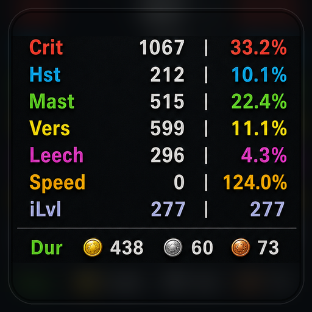
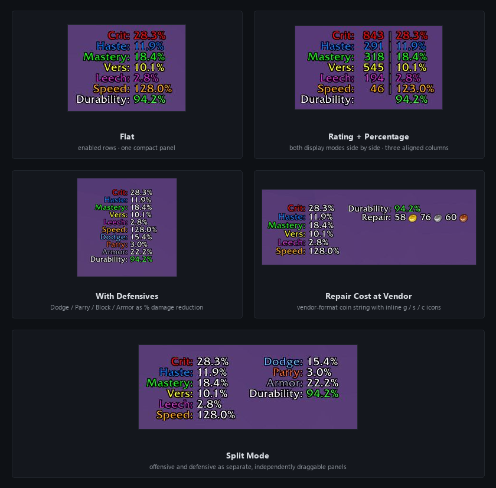
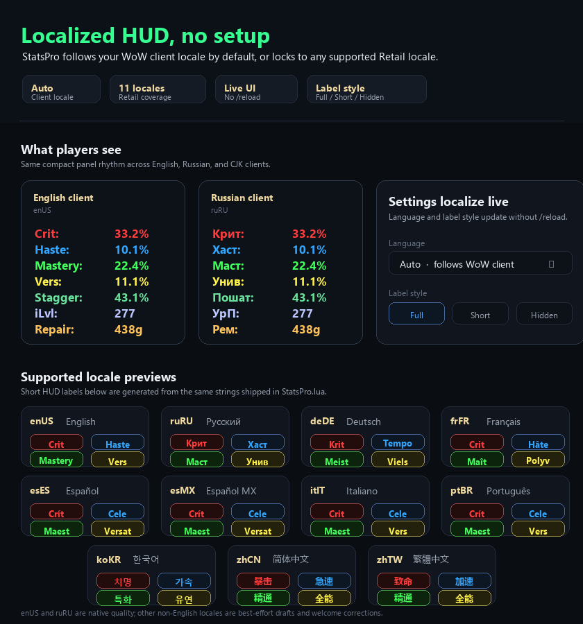
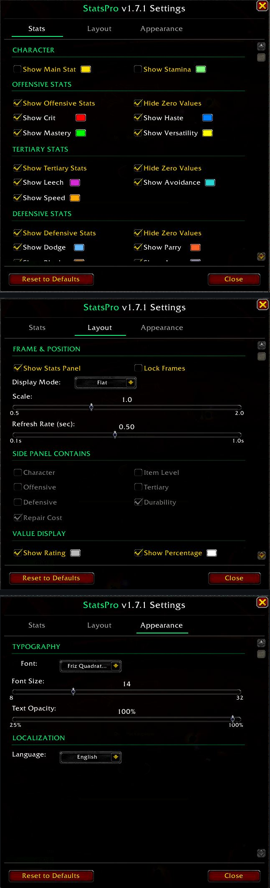

  

<h1 align="center">StatsPro</h1>

  
  
  
  
  

  A clean on-screen HUD for World of Warcraft Retail. Secondary stats, item level,
  defensive stats, durability, and optional live repair cost in draggable panels —
  without the bloat of a full framework.

  

> Originally inspired by [SwiftStats by TaylorSay](https://www.curseforge.com/wow/addons/swiftstats)
> (MIT) — substantially rewritten and extended. The side-panel layout, durability and
> repair-cost system, configurable multi-panel routing, auto-aligning column rendering, 12.x retail
> secret-value handling, and the three-tab settings UI are all original work; some
> upstream boilerplate, color defaults, and the basic stat list remain. See
> [`CHANGELOG.md`](CHANGELOG.md) for the full list of additions per version.

## Features

- **Secondary stats** — Crit, Haste, Mastery, Versatility (with rating + percentage display options)
- **Tertiary stats** — Leech, Avoidance, Speed
- **Main stat auto-detect** — Strength / Agility / Intellect resolves automatically from your active spec; no toggling when you respec or swap characters
- **Stamina** — optional row for tanks tracking effective HP and any spec watching consumable contributions (raid buffs / flask / food included), default OFF
- **Item Level** — optional equipped / overall row (`271 / 273`) with a colored warning when your bags out-level what you are wearing, default OFF
- **Defensive stats** — Dodge, Parry, Block, Armor (as % damage reduction)
- **Durability** — average or worst-slot percentage with auto-color thresholds (green / yellow / red)
- **Repair cost** — optional live vendor-format coin display (`46g 40s 81c` with embedded gold/silver/copper icons), default OFF
- **Three display modes** — Flat (one panel), Sectioned (one panel with block headers), Split (two movable panels with configurable block routing)
- **Localized stat labels** — on-screen panel auto-translates to your WoW client language across all 11 retail locales (deDE, esES, esMX, frFR, itIT, koKR, ptBR, ruRU, zhCN, zhTW; English unchanged). Use the **Language** dropdown in Appearance → Localization to choose Auto or a fixed locale, and **Label Style** in Layout → Value Display to switch **Full / Short / Hidden** label rendering. **The settings window itself also localizes** — every tab, label, dropdown caption, button, and warning updates live the moment you switch languages, no `/reload` needed.
- **Customization** — per-stat colors, fonts via LibSharedMedia, font size, panel scale, refresh rate
- **Auto-aligning columns** — labels and values stay neatly aligned regardless of which stats are enabled, font, or scale; toggling rating-only or percent-only collapses cleanly into one tight column with no awkward gaps
- **Light footprint** — core UI in one Lua file, no Ace3; bundles standard LibSharedMedia support for font picking

## How it looks

Layouts auto-fit to enabled stats, drag panels anywhere, no awkward gaps when
toggling columns. Top: **Flat** (default secondary stats) and **Rating + Percentage**
(both columns side by side). Middle: **With Defensives** (Dodge / Parry / Block /
Armor as % damage reduction) and **Repair Cost at Vendor** (vendor-format coin
string with inline gold / silver / copper icons). Bottom: **Split Mode** —
two independently draggable panels whose side-panel contents can be customized
from Character / Item Level / Offensive / Tertiary / Defensive / Durability / Repair.

## Highlights

- **Reads at a glance** — labels and values stay neatly aligned no matter how many
  stats you've enabled or what font you've chosen. Toggle to rating-only or
  percent-only and everything collapses cleanly into a single tight column — no
  awkward gaps, no drifting percent column.
- **Tertiary stats on demand** — Leech, Avoidance, and Speed are first-class rows
  with their own toggles. Most stat addons silently omit them; theorycrafting builds
  that lean on tertiaries can finally see what they're doing without a separate addon.
- **Vendor-accurate repair cost** — shows as `46g 40s 81c` with the inline gold /
  silver / copper icons you see at the vendor, not a stripped-down `46g`. A lot of
  older stat addons quietly broke in modern Retail because they rely on the legacy
  tooltip API; StatsPro uses the new one.
- **Drag once, done forever** — your panel positions survive `/reload`, logout, and
  client patches. No reset-to-center surprises after a UI reload or expansion update.
- **Configurable from one place** — every visible element lives behind `/ss`:
  per-stat colors, font via LibSharedMedia, panel scale, layout preset, split
  block routing, durability thresholds. No SavedVariables editing, no `/reload`
  between tweaks.
- **Built for Midnight (12.x)** — works correctly mid-combat where many older stat
  addons silently break (see the section below).

## Built for Midnight (12.x)

Blizzard quietly turned many stat-API returns (`GetCombatRating`, `UnitArmor`, even
`FontString:GetStringWidth`) into "secret values" in modern Retail, and the
protection has only tightened in Midnight (12.x). Read them naively in combat
and you get `[secret]` placeholders in the UI, or — worse — silently leak taint
into action bars, macros, and other addons.

StatsPro defends against this end-to-end:

- Every stat read is wrapped in `pcall + issecretvalue` before display
- FontString widths are cached when non-secret, so the auto-fit layout stays stable
  mid-pull instead of collapsing to zero
- Repair cost uses the modern `C_TooltipInfo.GetInventoryItem` API (the legacy
  `GameTooltip:SetInventoryItem` returns the cost as a secret value in 12.x — a lot
  of older HUD-style addons broke quietly because of this)

If you're not sure whether your current stat addon is Midnight-safe, run a heavy
pull and check whether the numbers stay correct throughout the fight.

## Localization

Stat labels render in your WoW client's language by default — no setup required.
Curated short-form translations across all 11 retail WoW locales preserve the same
compact 4-7 char visual rhythm as the original English labels:

| Locale | Sample row |
|---|---|
| **enUS** | `Crit:    843  28.3%` |
| **ruRU** | `Крит:    843  28.3%` |
| **deDE** | `Krit:    843  28.3%` |
| **frFR** | `Crit:    843  28.3%` |
| **esES** / **esMX** | `Crít:    843  28.3%` |
| **itIT** | `Crit:    843  28.3%` |
| **ptBR** | `Crít:    843  28.3%` |
| **koKR** | `치명:    843  28.3%` |
| **zhCN** | `暴击:    843  28.3%` |
| **zhTW** | `致命:    843  28.3%` |

To pick a different language for stat labels, open `/ss` → **Appearance**
tab → **Localization** → use the **Language** dropdown. "Auto" follows your
WoW client locale. To change how compact the labels look, open `/ss` →
**Layout** tab → **Value Display** → **Label Style** and choose **Full**,
**Short**, or **Hidden**. These settings persist across `/reload` and across
all characters on the account. The entire settings window re-localizes live
the moment you change language — every label, dropdown, and button reflects
the chosen locale immediately.

The in-game AddOn list (Esc → Options → AddOns) also shows StatsPro's
description in your client language — a localized one-liner per `## Notes-<locale>`
TOC field is shipped for all 10 non-English retail locales.

If a label reads oddly to you as a native speaker, please open an issue with the
suggested correction — single-row fixes ship in the next patch.

## Slash commands

| Command | Action |
|---|---|
| `/ss` or `/statspro` | Open settings window |
| `/ss show` | Show stats panel |
| `/ss hide` | Hide stats panel |
| `/ss toggle` | Toggle visibility |
| `/ss reset` | Reset all settings to defaults (without opening the window) |
| `/ss debug` | Dump runtime state to chat (for bug reports) |
| `/ss help` | List commands in chat |

**Tip:** right-click anywhere on the stats panel also opens settings — same as `/ss`. To bind a key for toggling visibility, create a macro running `/ss toggle` and bind it from Esc → Options → Keybindings → Macros.

> Note: many users add `/ss` as a screenshot macro. If you have one, use the
> `/statspro` alias instead — it's an equivalent built-in command.

## Installation

**CurseForge:** [www.curseforge.com/wow/addons/statspro](https://www.curseforge.com/wow/addons/statspro)
— install via the CurseForge App or WowUp.

**Manual:** download the latest zip from the
[Releases page](https://github.com/Antrakt92/StatsPro/releases/latest), extract the
`StatsPro` folder into `World of Warcraft\_retail_\Interface\AddOns\`.

## Configuration

Type `/ss` or click the StatsPro entry in the Blizzard AddOns settings panel to
open the configuration window. Three tabs (`Stats | Layout | Appearance`) cover
everything:

| Tab | What lives here |
|---|---|
| **Stats** | Character rows (Show Main Stat, Stamina), Item Level, Offensive, Tertiary, Defensive, and Gear toggles with inline color swatches |
| **Layout** | Visibility / Lock, Display Mode, **Side Panel Contains** routing for Split mode, **Value Display** controls (Show Rating / Show Percentage / Label Style / Match Value Color to Stat), Scale, Refresh Rate |
| **Appearance** | Typography (Font / Font Size / Text Opacity), Localization (Language picker + font-coverage warning) |

## Compatibility

- **WoW Retail Midnight** — Interface `120005, 120007`
- Classic / TBC / MoP Classic — not supported (Retail-only at this time)

## Architecture (contributors / forks)

Core single-file design. Everything renders out of [`StatsPro.lua`](StatsPro.lua):

- **`Panel:SetTextSafe`** — three-FontString rendering (label / rating / value), each
  with its own `JustifyH` for column alignment, plus two more for the dedicated
  repair row (label + coin). Caches non-secret widths per render to survive in-combat
  measurement taint.
- **`FmtRatingPct` / `FmtPctOnly` / `RouteValueOnly`** — column-routing helpers.
  Dual-column mode = both display toggles on; otherwise everything stacks in the
  rating column. `IsDualColMode()` is the single source of truth for that decision.
- **`UpdateStats`** — drives the per-frame OnUpdate, builds logical render blocks
  (Character / Item Level / Offensive / Tertiary / Defensive / Durability / Repair),
  routes them by display mode, and gates value-column joining on `IsDualColMode()`.
- **`LABELS_BY_LOCALE` + `L()` + `GetStyledLabelText()` + `FormatLabel()` + `PushLocalizedLabel`** — i18n
  and label-presentation layer. One table indexed by locale; `L()` resolves the
  active locale, `GetStyledLabelText()` applies the `Full / Short / Hidden`
  label-style rule with UTF-8-safe short labels, and `FormatLabel()` composes
  that with row color in a single call. `PushLocalizedLabel` registers
  settings-UI setter closures so labels update live when the user picks a new
  locale via the Language dropdown — no `/reload` required. Identity-fast-path
  on enUS (no allocation, no table read).
- **`MigrateDB`** — DB schema versioning. Bump `CURRENT_DB_VERSION` and add a
  conditional `vN-1 → vN` clause when changing a default value, so existing users
  on the old default upgrade automatically while explicit user choices are preserved.

The repository's [`CHANGELOG.md`](CHANGELOG.md) documents what shipped per version
and why. Tricky 12.x retail API behavior (secret-value handling, FontString taint,
layout ordering quirks) is annotated as `WHY:` / `WARNING:` comments at the
relevant call sites.

## Bug reports / feature requests

Open an issue on [GitHub Issues](https://github.com/Antrakt92/StatsPro/issues).
Helpful to include: WoW client version, addon version (visible in the settings
window header), exact reproduction steps, and a screenshot if the issue is visual.

## Support

StatsPro is free and MIT-licensed. If it saves you time and you'd like to support
continued addon work:

- **Ko-fi** — [ko-fi.com/antrakt92](https://ko-fi.com/antrakt92) (one-time or recurring)
- **GitHub Sponsors** — the **❤ Sponsor** button at the top of this repo

Bug reports and PRs remain the highest-leverage way to help — open an
[issue](https://github.com/Antrakt92/StatsPro/issues) any time.

## Acknowledgements

- **[@tflo](https://github.com/tflo)** — auto main stat, text opacity, item level,
  stamina, right-click-to-settings, and label style modes feedback (issue #1).
- **[TaylorSay](https://www.curseforge.com/members/taylorsay)** — author of the
  original [SwiftStats](https://www.curseforge.com/wow/addons/swiftstats) addon
  (MIT), the project that inspired StatsPro and from which the initial defaults
  and color scheme are derived.
- **[LibSharedMedia-3.0](https://www.curseforge.com/wow/addons/libsharedmedia-3-0)** — font selection support.

## License

[MIT](LICENSE). Original SwiftStats portions (boilerplate, color defaults, basic
stat list) © TaylorSay; all StatsPro extensions © Antrakt. See [`LICENSE`](LICENSE)
for the full text.
